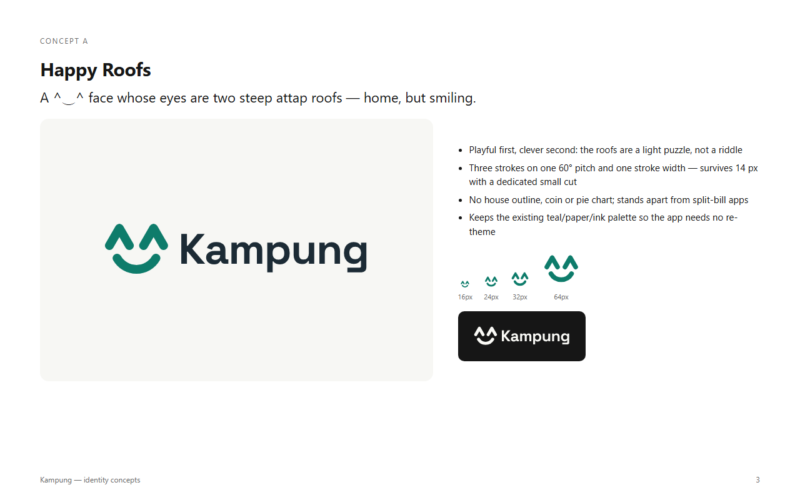
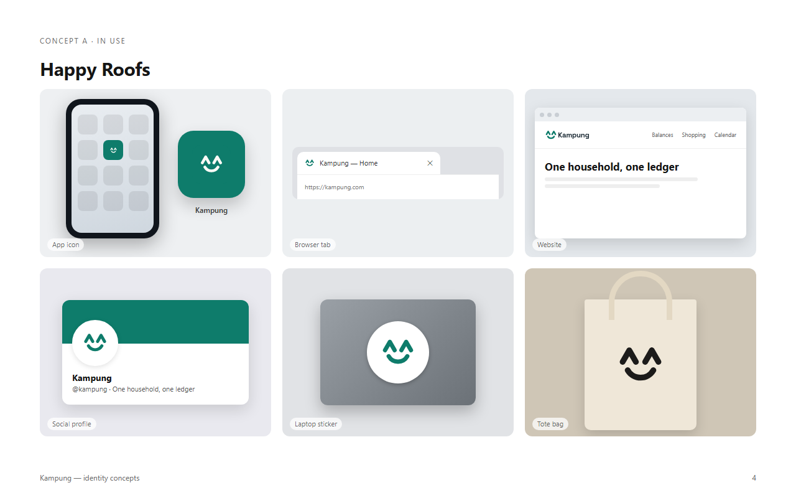

# Kampung — logo guidelines

## 1. The logo

**Idea:** a `^‿^` face whose eyes are two steep attap roofs — home, but smiling.
Playful first; the roofs are a light second read, not a riddle.

**Construction:** three strokes of one width on a 256 grid. Both roofs use a
60° pitch; every end and joint is round. Masters are filled outlines only (no
strokes, live text, filters or transforms).

| Version | File | Use for |
|---|---|---|
| Horizontal (primary) | `svg/kampung-horizontal-color.svg` | Headers, landing page, anywhere with room |
| Stacked | `svg/kampung-stacked-color.svg` | Square-ish spaces, splash screens |
| Symbol | `svg/kampung-symbol-teal.svg` | Above 24 px, on its own |
| Symbol, small cut | `svg/kampung-symbol-small-teal.svg` | **24 px and below** (heavier strokes, shorter roofs) |
| App icon tile | `svg/kampung-app-icon.svg` / `-small.svg` | Home-screen icon / favicon |
| Wordmark | `svg/kampung-wordmark-ink.svg` | Only where the symbol already appears nearby |

One-colour versions: `-black`, `-ink`, `-teal`; light-on-dark: `-reversed`
(its strokes are thinned to 28.5 from 30, to offset irradiation).

## 2. Clear space

Keep a clear zone of **one roof's width** (≈ a quarter of the symbol's width)
on every side. It scales with the logo.

## 3. Minimum size

| Version | Screen |
|---|---|
| Horizontal | 96 px wide |
| Symbol | 14 px (small cut) — the in-app header size |
| App icon tile | 16 px (small-cut tile, `favicon.ico`) |

## 4. Colour

The mark keeps the app's existing tokens (`tailwind.config.ts`), so nothing in
the UI had to change.

| Name | HEX | RGB | Role |
|---|---|---|---|
| Teal (`accent`) | `#0E7C6B` | 14 124 107 | Symbol, app-icon tile |
| Ink (`ink`) | `#1C2B35` | 28 43 53 | Wordmark, one-colour dark |
| Paper (`paper`) | `#FAFAF6` | 250 250 246 | Reversed mark, tile foreground |

**Approved pairs:** teal symbol + ink wordmark on paper/white · paper on teal ·
paper on ink · black on white · white on black.

## 5. Typography

Wordmark: **Space Grotesk Bold (700)**, tracking −2 %, converted to outlines
(SIL Open Font License — logo use permitted). App UI: Space Grotesk display /
Inter body, as today.

## 6. Don'ts

Don't stretch, rotate or tilt the face · don't recolour outside the palette ·
don't close up or widen the gap between the roofs (it becomes an "M") · don't
add outlines, shadows or gradients · don't use the master below 24 px — use the
small cut · don't retype the wordmark; use the outlined file.

## 7. Files

- `svg/` — masters and lockups
- `web/` — `favicon.ico` (16/32/48), `favicon.svg`, PNG favicons,
  `apple-touch-icon.png` (180), `icon-192/512.png`, `maskable-512.png`
- `png/` — 1200 px lockups, presentation board slides
- `build.py` — regenerates `svg/` from the geometry parameters. Needs
  `pip install fonttools` and `SpaceGrotesk[wght].ttf` from
  [google/fonts](https://github.com/google/fonts/tree/main/ofl/spacegrotesk)
  next to it; writes to `./kit/`.

Wired into the app: `src/components/KampungArt.tsx` (`KampungMark`, small cut,
`currentColor`), `src/app/icon.svg` (small-cut tile), `src/app/favicon.ico`,
`src/app/apple-icon.png`.

